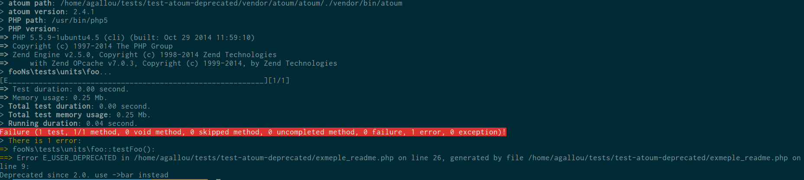
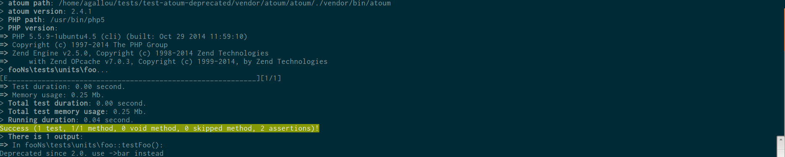

# atoum/deprecated-extension

This extension allows you to avoid having `E_USER_DEPRECATED` errors treated errors, and display the list of deprecated calls at the end of the tests.

When your library uses the `trigger_error` function to indicate that the method is deprecated, or when you use a class that does that in your test, you may not want to see your tests fail. This extension will allow to have your atoum's test pass event if you have deprecated calls, so will be able to migrate the deprecated calls at your own pace.

## Example

Let's take this example :

```php
<?php

namespace fooNs
{
    class foo
    {
        public function foo()
        {
            trigger_error('Deprecated since 2.0. use ->bar instead', E_USER_DEPRECATED);
            return "foo";
        }
    }
}

namespace fooNs\tests\units
{
    use mageekguy\atoum;

    class foo extends atoum\test
    {
        public function testFoo()
        {
            $this
                ->if($testedClass = new \fooNs\foo)
                ->then
                    ->string($testedClass->foo())
                        ->isEqualTo('foo')
            ;
        }
    }
}

```

Without the extension the test fails, and we get an output like this :



With the extention the test pass, and the deprecated call is displayed at the end of the test.




## Install it

Install extension using [composer](https://getcomposer.org):

```
composer require --dev atoum/deprectated-extension
```

Enable the extension using atoum configuration file:

```php
<?php

// .atoum.php

require_once __DIR__ . DIRECTORY_SEPARATOR . 'vendor' . DIRECTORY_SEPARATOR . 'autoload.php';

$runner->addExtension(new \mageekguy\atoum\deprecated\extension($script));
```


## Other examples

### Tests on the error

You can still use the atoum's error asserter. But beware, the tested error will not be displayed in the report at the end of the output. For example :

```php
public function testError()
{
    $this
        ->if($testedClass = new \fooNs\foo)
        ->then
        ->string($testedClass->foo())
            ->error("Deprecated since 2.0. use ->bar instead", E_USER_DEPRECATED)->exists()
    ;
}
```

## License

deprecated-extension is released under the MIT License. See the bundled LICENSE file for details.
